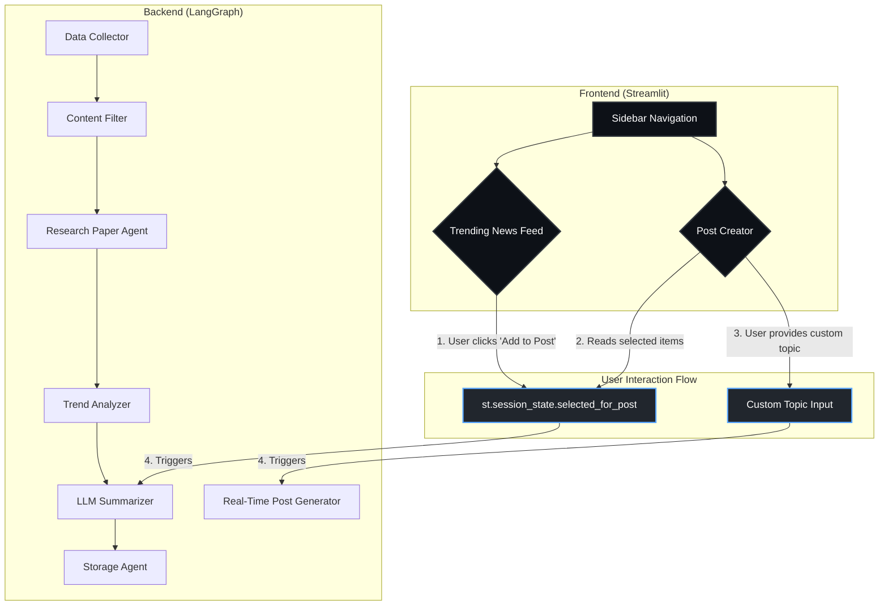

# AI News Dashboard v3 - Architecture & Design Specification

**Authored by:** HMtechie & ByteBuilder

This document outlines the redesigned architecture for the AI News Dashboard v3, focusing on a streamlined two-panel user experience, a robust LangGraph-powered backend, and clear branding.

---

## 1. Core Principles & Goals

- **Simplified User Experience:** The primary goal is to simplify the UI into two distinct, intuitive sections: a **Trending News Feed** for consumption and a **Post Creator** for generation.
- **Human-in-the-Loop Workflow:** The user should be able to easily select interesting articles from the feed and use them as context for generating new posts.
- **Robust On-Demand Research:** The "custom topic" feature must be powerful, leveraging real-time search and multiple sources to generate high-quality, referenced posts from scratch.
- **Professional Branding:** The application must have a clean, modern aesthetic and consistently display the HMtechie & ByteBuilder branding.
- **Maintainable Code:** The backend agent graph and frontend application logic must be modular and easy to understand.

---

## 2. Frontend Architecture (Streamlit)

The UI will be rebuilt around a two-section navigation model, managed via `st.session_state`.

### 2.1. UI Components

| Component | Description |
|---|---|
| **Main App** | The central Streamlit script. Manages navigation between the two main panels and holds the shared `session_state`. |
| **Sidebar** | Simplified to only contain the main navigation links ("Trending News Feed", "Post Creator"), branding, and a link to the project's GitHub. The LLM settings will be removed entirely from the UI. |
| **Trending News Feed Panel** | Displays all collected content (articles, papers, repos) in a unified, scrollable view. Each item card will have an **"Add to Post Creator"** button. |
| **Post Creator Panel** | The main workspace for content generation. It will contain a multi-step workflow to guide the user through post creation. |

### 2.2. State Management (`st.session_state`)

The key to the new UX is a well-managed session state.

```python
# st.session_state keys
{
  "page": "feed",  # or "creator"
  "selected_for_post": [
      {"title": "...", "summary": "...", "url": "..."}, # List of full article/paper dicts
      # ...
  ]
}
```

### 2.3. User Workflow

1.  **Start on Feed:** The user lands on the **Trending News Feed**.
2.  **Select Content:** The user scrolls through the feed and clicks **"Add to Post Creator"** on interesting articles. This appends the article's data to `st.session_state.selected_for_post`.
3.  **Navigate to Creator:** The user clicks "Post Creator" in the sidebar.
4.  **Choose Template:** The user selects a post template (e.g., "Tech Insight", "Weekly Update").
5.  **Choose Content Source:** The user is presented with two choices:
    *   **A) Use Saved Content:** A multi-select box shows the titles of articles from `st.session_state.selected_for_post`. The user can select one or more.
    *   **B) Use Custom Topic:** A text input for a new topic or URL.
6.  **Generate:** The user clicks "Generate Post". The backend is called with the chosen template and content source.
7.  **Display Result:** The generated post is displayed in a text area, with the "Follow ByteBuilder for more..." footer automatically appended.

---

## 3. Backend Architecture (LangGraph)

The backend agent graph remains largely the same for data collection but will be augmented to handle the new post creation logic.

### 3.1. Agent Graph & State

The core pipeline remains:
`DataCollector` → `ContentFilter` → `ResearchPaperAgent` → `TrendAnalyzer` → `LLMSummarizer` → `StorageAgent`

- The **`LLMSummarizer`** agent's prompt templates will be updated to include the `"---\nFollow ByteBuilder for more AI and tech insights!"` footer.
- The **`RealtimePostGenerator`** agent will be the workhorse for the "Custom Topic" feature in the Post Creator.

### 3.2. Architecture Diagram



---

## 4. Branding Specification

- **Sidebar:** A section at the bottom of the sidebar will contain:
    > Developed by **HMtechie & ByteBuilder**
    > [View on GitHub](link)
- **Post Footer:** All generated posts, regardless of template, will have the following text appended:
    > ---
    > Follow ByteBuilder for more AI and tech insights!
- **UI Theme:** Continue using the clean, modern, dark-mode theme with the GitHub-inspired color palette.
